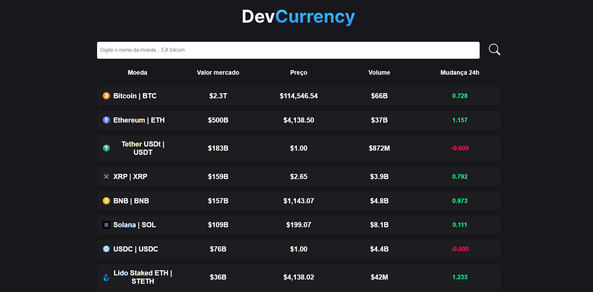

<p align="center">
  
</p>

# Dev Currency 💰

Aplicativo web desenvolvido em **React + TypeScript + Vite** que exibe preços e variações de criptomoedas em tempo real. Os dados são obtidos pela API pública **[CoinCap.io](https://coincap.io/)**.  

O projeto foi desenvolvido durante o curso **O Sujeito Programador**, com foco em boas práticas, componentização e consumo de APIs.

🔗 **Acesse o projeto online:** [https://dev-currency.vercel.app](https://dev-currency.vercel.app)

---

## 🧠 Tech Stack

<!--- # "Verify icons availability here https://github.com/tandpfun/skill-icons" -->

[](https://skillicons.dev)

---

## 🚀 Getting Started

1. **Instalar dependências**  
   ```bash
   npm install
    ````

2. **Rodar o projeto**

   ```bash
   npm run dev
   ```
3. **Abrir no navegador**

   ```
   http://localhost:5173
   ```

---

## 📱 Funcionalidades

* Exibe lista de criptomoedas com preço e variação em tempo real
* Interface moderna, responsiva e performática
* Atualização automática dos valores
* Consumo direto da API CoinCap

---

## 🤝 Contribuir

1. **Clonar o projeto**

   ```bash
   git clone https://github.com/jotavitorz/cryptocurrency-app.git
   ```
2. **Criar uma branch para sua feature**

   ```bash
   git checkout -b feature/NOME
   ```
3. **Commitar e enviar suas alterações**

   ```bash
   git commit -m "feat: adiciona nova feature"
   git push origin feature/NOME
   ```

---

## 🪪 License

Este projeto está sob a licença [MIT](https://rem.mit-license.org).
